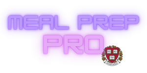

# 🍽️ Meal Prep Pro

**Meal Prep Pro** is a terminal-based Python application built as a final project for **CS50P**. It helps users generate weekly meal plans, calculate calorie intake, and create personalized grocery lists. Whether you're a student living alone or someone looking to simplify weekly meal prep, Meal Prep Pro is designed to make your life easier — one meal at a time.

<p align="center">
  
</p>

---

## 🎓 About This Project

This project was built as part of **CS50’s Introduction to Programming with Python** — also known as **CS50P**, a course offered by [Harvard University](https://cs50.harvard.edu/python) and taught by [Professor David J. Malan](https://github.com/dmalan).

CS50P empowers students to explore problem-solving through Python, and **Meal Prep Pro** represents the final project submitted to demonstrate concepts like file handling, randomness, user interaction, and data structuring — all within a real-world use case.

Special thanks to Professor Malan and the entire CS50 staff for an inspiring and rigorous learning experience.

<p align="center">
  
</p>


---

## 📋 Features

- 🍳 Generate a **7-day meal menu** (breakfast, lunch, dinner)
- 🔁 Add new recipes to the database
- 🔢 View the **calorie intake** of your weekly plan
- 🛒 Generate a **grocery list** based on your meal plan
- 🥗 Search the ingredients of a specific recipe

All actions are easily triggered via simple numeric inputs in the terminal.

---

## ⚙️ Setup Instructions

### 1. Clone the Repository

```bash
git clone https://github.com/your-username/meal-prep-pro.git
```

### 2. Install Dependencies

```bash
pip install -r requirements.txt
```

### 3. Run the Program

```bash
python3 project.py
```

---

## 🧩 Technologies Used

- **Python 3**
- **tabulate** – for beautifully formatted tables
- **CSV & TXT files** – for data storage and recipe management


---

## 📁 Project Structure

- `project.py` – Main script to run the app  
- `test_project.py` – Script to test functions  
- `requirements.txt` – Python package dependencies  
- `breakfast.txt` – Recipes categorized as breakfast  
- `lunch.txt` – Recipes categorized as lunch  
- `dinner.txt` – Recipes categorized as dinner  
- `calories.csv` – Stores recipes with their calorie counts  
- `groceries.csv` – Stores ingredients for each recipe  
- `README.md` – Project documentation  
- `assets/` – Folder containing project visuals:
  - `MPP.png` – Logo for Meal Prep Pro  
  - `Harvard_University_logo.png` – Harvard logo

---

## 📝 Example Usage

When the app launches, you'll see:  
→ Tap **1** to generate your 7-day menu <br>
→ Tap **2** if you want to add new meals to the collection <br>
→ Tap **0** to end the program <br><br>

If you choose to generate a menu:  
→ Tap **3** to display this menu's calorie intake <br>
→ Tap **4** to generate a groceries list for this menu <br>
→ Tap **5** to search for the ingredients of a recipe <br>
→ Tap **0** to end the program

---

© 2024 **Meal Prep Pro** | Built by Tidjani for **CS50P**. All rights reserved.

